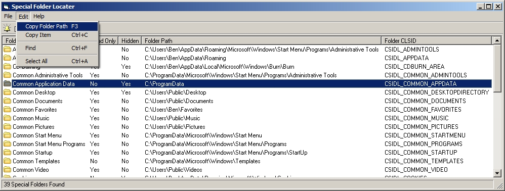



## Special Folder Locator

### Description

This is a small tool for locateing Special Folder on your system, that can some times be hard to find, you can also create a shortcut on your desktop to the folder, anyway hope you like the first version. Please vote if you like this code.
 
### More Info
 

             |
---                |---
**Submitted On**   |2010-02-01 21:42:54
**By**             |[dreamvb](https://github.com/Planet-Source-Code/PSCIndex/blob/master/ByAuthor/dreamvb.md)
**Level**          |Beginner
**User Rating**    |5.0 (15 globes from 3 users)
**Compatibility**  |VB 6\.0
**Category**       |[Complete Applications](https://github.com/Planet-Source-Code/PSCIndex/blob/master/ByCategory/complete-applications__1-27.md)
**World**          |[Visual Basic](https://github.com/Planet-Source-Code/PSCIndex/blob/master/ByWorld/visual-basic.md)
**Archive File**   |[Special\_Fo217413222010\.zip](https://github.com/Planet-Source-Code/dreamvb-special-folder-locator__1-72884/archive/master.zip)

